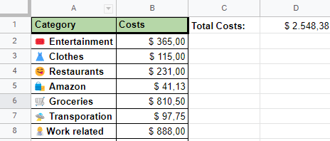
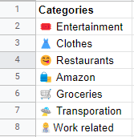
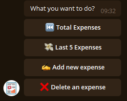
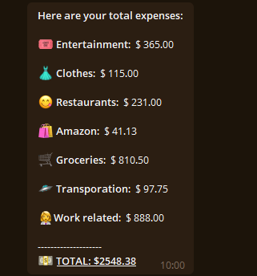
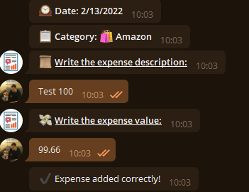
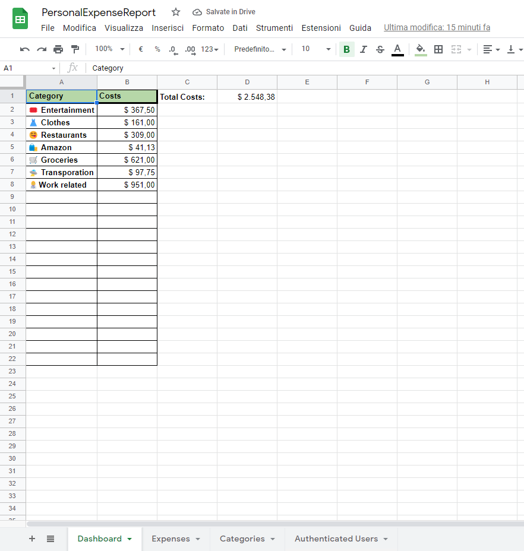
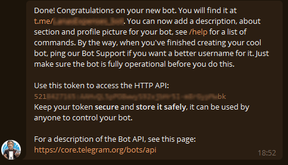
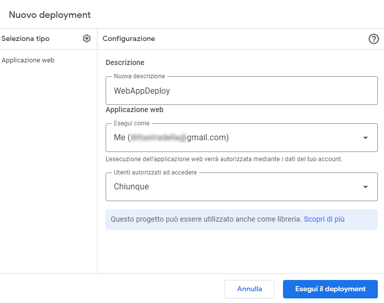

**SUMMARY**
- [🔎 Purpose](#-purpose)
  - [Features](#features)
  - [Screenshots](#screenshots)
- [💪 Installation](#-installation)
  - [1. Copy Google Spreadsheet](#1-copy-google-spreadsheet)
  - [2. Create a Telegram Bot](#2-create-a-telegram-bot)
  - [3. Add App Script to Google Sheet](#3-add-app-script-to-google-sheet)
  - [4. Deploy App Script as Web Application](#4-deploy-app-script-as-web-application)
  - [5. App Script personalization with tokens](#5-app-script-personalization-with-tokens)
    - [Telegram Token](#telegram-token)
    - [Web App Url](#web-app-url)
    - [Google Spreadsheet Id](#google-spreadsheet-id)
  - [6. Update App Script Deployment](#6-update-app-script-deployment)
  - [7. Execute getMe and setWebhook functions](#7-execute-getme-and-setwebhook-functions)
  - [8. Enable Telegram Bot](#8-enable-telegram-bot)

# 🔎 Purpose
The purpose of this open source software is to provide a solution to **personal expense report**.

This solution includes a **Google Spreadsheet** where all expenses are reported, and a **Telegram bot** integration that allows to view the **latest expenses**, the **total of expense** and to **add or delete expenses**.

## Features
* ✅ Useful **dashboard** to keep track of your expenses total
* ✅ Easy **personalizable** expense **categories**
* ✅ **Data validation** in expense sheet
* ✅ **Telegram bot integration** with **security protocol** to avoid unexpected unknown users interaction

## Screenshots

| Dashboard  | Expenses  |
|---|---|
|   |   |

| Personalizable categories  | Telegram Bot Main Menu  |
|---|---|
|   |   |

| Telegram Bot Total Expense   | Telegram Bot Add new expense  |
|---|---|
|   |   |


# 💪 Installation
## 1. Copy Google Spreadsheet
Create a **local copy** to your Google Drive of the following **spreadsheet**:
* 👉 **[Copy Spreadsheet](https://docs.google.com/spreadsheets/d/1VyCrEkmIRz4T_TmcKiy__y4NPLEFspRelXOKIIBrvbI/edit?usp=sharing)**

Remember to save your **!!LOCAL COPY!! Google Spreedsheet Id** because will be used in the next steps.
e.g.: https://docs.google.com/spreadsheets/d/1VyCrEkmIRz4T_TmcKiy__y4NPLEFspRelXOKIIBrvbI/edit#gid=479673556
**The spreedsheet id is '1VyCrEkmIRz4T_TmcKiy__y4NPLEFspRelXOKIIBrvbI'** <- T**his is just an example, you will have definetely a different Google Sheet Id, don't use this otherwise the Telegram Bot integration will not work**

**PAY ATTENTION:** Do not change any sheet name and any column headers otherwise you'll need to update also Telegram bot source code.



## 2. Create a Telegram Bot
If you want to **integrate the Google Spreadsheet with Telegram**, proceed with creating a Telegram Bot.

* 👉 **[How to create a Telegram Bot](https://riptutorial.com/telegram-bot/example/25075/create-a-bot-with-the-botfather)**
* If you already know how to **create a bot**, here there is the link to **talk with [@BotFather](https://t.me/BotFather)**

Remember to save your **Telegram Token Id** because will be used in the next steps.



## 3. Add App Script to Google Sheet
**Copy the content of [TelegramBotIntegration.js](TelegramBotIntegration.js)** source code to a new App Script.

Follow this Google Guide to learn how to add a new App Script:
* 👉 **[How to add an App Script to a Google Sheet](https://developers.google.com/apps-script/guides/sheets/functions)**


## 4. Deploy App Script as Web Application
Perform a new deployment of the App Script as a Web Application.
* Type: **Web Application**
* Description: **as you prefer** (e.g. WebAppDeploy)
* Execute as: **Me**
* Access authorization: **Everyone**
* Click on **Execute Deployment**
* Click on **Authorize Access**
* Click on **Advanced** in bottom left corner
* Click on **Open (app script name) (not secure)**
* Click on **Allow**
* **SAVE WEB APPLICATION URL GENERATED** (e.g. https://script.google.com/macros/s/AKfycbwHkLLHeAY-07_A2dmXftSX0JNR8gTpeREQmzo2j2aWmItIuSsFSYzlB1bJNw0Dovd3qw/exec)
* Click on **Finish**
  
In case of problems please **follow this Google guide**:
* 👉 **[How to deploy an App Script](https://developers.google.com/apps-script/concepts/deployments#new-editor_1
)**




## 5. App Script personalization with tokens
In order to integrate Telegram Bot with Google Sheet we need to **personalize the App Script with the tokens saved in the steps above mentioned**

### Telegram Token
Insert the **telegram token** saved in step '[2. Create a Telegram Bot](#2-create-a-telegram-bot)' into the variable '**token**' as follows:

```
/**
 * @var token
 * @brief 1. Fill with your own Telegram Bot Token Id
 *        (e.g. 521xxxx7165:AAHxxxxxxxxjbHr5l-m8rGxxxxxxwbk)
 */
var token = "521xxxx7165:AAHxxxxxxxxjbHr5l-m8rGxxxxxxwbk";
```

### Web App Url
Insert the **web application url** saved in step '[4. Deploy App Script as Web Application](#4-deploy-app-script-as-web-application)' into the variable '**webAppUrl**' as follows:

```
/**
 * @var webAppUrl
 * @brief 2. Fill with your google web app address
 *        (e.g. https://script.google.com/macros/s/AKfycbwHkLLHeAY-07_A2dmXftSX0JNR8gTpeREQmzo2j2aWmItIuSsFSYzlB1bJNw0Dovd3qw/exec)
 */
var webAppUrl = "https://script.google.com/macros/s/AKfycbwHkLLHeAY-07_A2dmXftSX0JNR8gTpeREQmzo2j2aWmItIuSsFSYzlB1bJNw0Dovd3qw/exec";
```

### Google Spreadsheet Id
Insert the **Google Spreedsheet Id** saved in step '[1. Copy Google Spreadsheet](#1-copy-google-spreadsheet)' into the variable '**ssId**' as follows:

```
/**
 * @var ssId
 * @brief 3. Fill with Google Spreadsheet Id
 *        (e.g. 1f_IT_kAFIG0TUOZyXL3nW67fxvd0fuSaw6gbAbtxzEo)
 */
var ssId = "1f_IT_kAFIG0TUOZyXL3nW67fxvd0fuSaw6gbAbtxzEo";
```

## 6. Update App Script Deployment
After those personalization we need to update the App Script deployment.
* Click on **Execute deployment**
* Click on **Manage deployment**
* Click on **Modify icon**
* Click on **Version**
* Click on **New Version**
  


## 7. Execute getMe and setWebhook functions
After having deployed the script, you've to execute 'getMe' and 'setWebhook' functions from Google Apps Script


## 8. Enable Telegram Bot
Send a **chat to your personal telegram bot** create in step '[2. Create a Telegram Bot](#2-create-a-telegram-bot)' **with any text**

**The bot will reply with:**
```
⛔️ You're not authorized to interact with this bot!
```


Go to the **Google Spreadsheet in "Logs" sheet, it will be present a new line as follows**:
```json
{
    "update_id": 642486188,
    "message": {
        "message_id": 765,
        "from": {
            "id": 8XXXXXXX6,
            "is_bot": false,
            "first_name": "XXXXXX",
            "last_name": "XXXXX",
            "username": "XXXXXX",
            "language_code": "it"
        },
        "chat": {
            "id": 8XXXXXX6,
            "first_name": "XXXXXX",
            "last_name": "XXXXX",
            "username": "XXXXX",
            "type": "private"
        },
        "date": 1644745924,
        "text": "Hello!"
    }
}
```


Copy the value of the **field message.from.id**, in this example has been censored as '8XXXXXXX6' and paste it to the sheet 'Authenticated Users' as follows:


Now **send another message to your Telegram bot** and it should reply to you with the main menu, and then you're ready to go **with your Telegram integration**!

